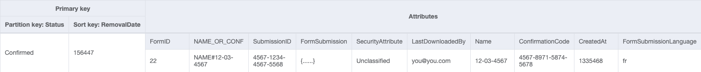
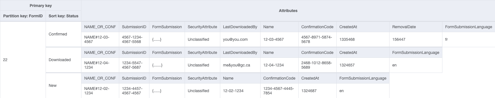
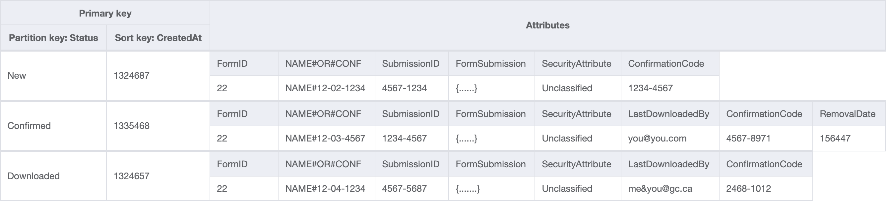

# Forms Terraform

Infrastructure as Code for the GC Forms environment.

## Running Lambdas and DBs locally

You will need to have the following installed on a MacOS machine.

Pre-requisites:

- Docker Hub: https://docs.docker.com/desktop/mac/install/

- Homebrew:
  ```bash
   /bin/bash -c "$(curl -fsSL https://raw.githubusercontent.com/Homebrew/install/HEAD/install.sh)"
  ```
- LocalStack : `brew install localstack`
- Terragrunt:

  1. `brew install warrensbox/tap/tfswitch`
  1. `tfswitch 1.4.2`
  1. `brew install warrensbox/tap/tgswitch`
  1. `tgswitch 0.46.3`

- Yarn: `brew install yarn`

- AWS CLI: `brew install awscli`

- AWS SAM CLI

  Please run these commands to install the aws sam cli using homebrew. The AWS SAM CLI is what we use to run the lambda functions locally and invoke them.

  1. `brew tap aws/tap`
  1. `brew install aws-sam-cli`

- Postgres and PGAdmin
  1. `brew install postgresql`
  1. `brew install --cask pgadmin4`

### Starting LocalStack and E2E testing from devcontainers

For instructions on how to run without using dev containers please skip to the next section.

1. forms-terraform:

```sh
# Build the local infrastructure (run on first setup and when there are Terraform changes)
make terragrunt

# Start the lambda functions
make lambdas
```

2. platform-forms-client:

```sh
# Install dependencies, run database migrations and start local server
yarn --cwd migrations install
yarn install
yarn dev
```

### Starting LocalStack and services without dev containers

#### Spare me the details and give me the commands

##### Only do once as part of setup

- You will also have to supply the following environment variables and values to platform-forms-client to get everything working with the local lambdas and localstack.

```shell
# localstack only simulates a us-east-1 region
AWS_ACCESS_KEY_ID=test
AWS_SECRET_ACCESS_KEY=test
AWS_REGION=ca-central-1
RELIABILITY_FILE_STORAGE=forms-local-reliability-file-storage
LOCAL_LAMBDA_ENDPOINT=http://127.0.0.1:3001
LOCAL_AWS_ENDPOINT=http://localhost:4566
```

##### Everytime you want to run localstack and lambdas locally

1. In one terminal run `localstack start`
2. In a second terminal run `./localstack_services.sh` (If there have been infrastructure changes you'll want to run `./localstack_services.sh clean`)
3. In a third terminal in the `platform-forms-client` repo run `yarn dev`

#### It didn't work.... I need the details

Once you have localstack installed you should be able to start the localstack container and services using the following command.

```shell
$ localstack start
```

You should see the following output if localstack has successfully started

```shell

     __                     _______ __             __
    / /   ____  _________ _/ / ___// /_____ ______/ /__
   / /   / __ \/ ___/ __ `/ /\__ \/ __/ __ `/ ___/ //_/
  / /___/ /_/ / /__/ /_/ / /___/ / /_/ /_/ / /__/ ,<
 /_____/\____/\___/\__,_/_//____/\__/\__,_/\___/_/|_|

 💻 LocalStack CLI 0.13.3

[19:49:57] starting LocalStack in Docker mode 🐳                                                                                     localstack.py:115
2022-01-17T19:49:58.192:INFO:bootstrap.py: Execution of "prepare_host" took 741.40ms
─────────────────────────────────────────────────── LocalStack Runtime Log (press CTRL-C to quit) ─────────────
```

If you have installed localstack via pip (python's package manager) and are receiving command not found errors. Please ensure that your python's bin is directly in the `$PATH`. If you are using pyenv with shims... this will not work. You need to reference the bin of the python version you are using directly in the path.

If you want to additionally verify what localstack services are running you can issue the following command

```shell
$ localstack status services
┏━━━━━━━━━━━━━━━━━━━━━━━━━━┳━━━━━━━━━━━┓
┃ Service                  ┃ Status    ┃
┡━━━━━━━━━━━━━━━━━━━━━━━━━━╇━━━━━━━━━━━┩
│ acm                      │ ✔ running │
│ apigateway               │ ✔ running │
│ cloudformation           │ ✔ running │
│ cloudwatch               │ ✔ running │
│ config                   │ ✔ running │
│ dynamodb                 │ ✔ running │
│ dynamodbstreams          │ ✔ running │
│ ec2                      │ ✔ running │
│ es                       │ ✔ running │
│ events                   │ ✔ running │
│ firehose                 │ ✔ running │
│ iam                      │ ✔ running │
│ kinesis                  │ ✔ running │
│ kms                      │ ✔ running │
│ lambda                   │ ✔ running │
│ logs                     │ ✔ running │
│ redshift                 │ ✔ running │
│ resource-groups          │ ✔ running │
│ resourcegroupstaggingapi │ ✔ running │
│ route53                  │ ✔ running │
│ s3                       │ ✔ running │
│ secretsmanager           │ ✔ running │
│ ses                      │ ✔ running │
│ sns                      │ ✔ running │
│ sqs                      │ ✔ running │
│ ssm                      │ ✔ running │
│ stepfunctions            │ ✔ running │
│ sts                      │ ✔ running │
│ support                  │ ✔ running │
│ swf                      │ ✔ running │
└──────────────────────────┴───────────┘
```

### Setting up local infrastructure

Now that we have localstack up and running it's time to configure our local AWS services with what the lambdas would expect as if running in an AWS environment.

**Please note if you stop localstack you will need to run this script again**
**Localstack does not persist states between restarts of the service**

run `./localstack_services.sh`

You will be asked at one point to enter the following values:

```
var.cognito_client_id
  User Pool Client ID for Forms Client

  Enter a value:

var.cognito_endpoint_url
  Cognito endpoint url

  Enter a value:

var.cognito_user_pool_arn
  User Pool ARN for the Forms Client

  Enter a value:

var.email_address_contact_us
  Email address for Form Contact Us

  Enter a value:

var.email_address_support
  Email address for Form Support

  Enter a value:

```

It is safe to leave them blank for now.

Congratulations! You should now have all the necessary infrastructure configured on localstack to run lambda functions completely locally without needing an AWS account.

### Configuring the environment

In the directory:
`./aws/app/lambda/local-development/`
`template.yml` defines the local environment / project we will be running. Functions and environment variables can be defined here.

### Dynamo Datbase Table Schemas

#### Vault Table

##### Table


##### Archive Global Secondary Index

This Index supports the archiving of Vault responses


##### Status Global Secondary Index

This Index supports the future feature of the Retrieval API. Essentially the ability to retrieve responses without using the Application Interface.


##### Nagware Global Secondary Index

This Index supports the Nagware feature. It gives the ability to retrieve form submissions with a specific status and creation date.


### Invoking Lambdas manually

If you want to invoke a lambda specifically, here’s the example command:
`aws lambda invoke --function-name "Submission" --endpoint-url "http://127.0.0.1:3001" --no-verify-ssl --payload fileb://./file.json out.txt`
**NOTE:** _`fileb://` allows a JSON file that uses UTF-8 encoding for the payload._

Troubleshooting
db host env var: runs in docker - need to get localhost for host machine
if you get connection errors: postgresql.conf listen address “\*”

Notes:
When running locally using AWS SAM, the env var `AWS_SAM_LOCAL = true` is set automatically - so I hook into this for local testing

#### Running the reliability lambda

Unfortunately due to AWS SAM limitations it is not possible to automatically trigger the reliability lambda function whenever an event is pushed to the SQS queue via the Submission lambda.

In order to run the reliability lambda. First spin up local lambdas using the `start_local_lambda` script and submit a form through the platform-forms-client.

You should see in the console the submission ID after the Submission function has successfully been invoked

```shell
START RequestId: 21a1df8b-ed4b-4fd5-8dad-e92ee76341ee Version: $LATEST
2022-01-19T09:16:08.084Z        21a1df8b-ed4b-4fd5-8dad-e92ee76341ee    INFO    {"status": "success", "sqsMessage": "aab25a19-e12e-5e72-fcde-b26ca07b2cda", "submissionID": "2dd4930d-cd77-41b3-a68e-9f44ef9e80f5"}
END RequestId: 21a1df8b-ed4b-4fd5-8dad-e92ee76341ee
REPORT RequestId: 21a1df8b-ed4b-4fd5-8dad-e92ee76341ee  Init Duration: 0.48 ms  Duration: 797.46 ms     Billed Duration: 798 ms Memory Size: 128 MB     Max Memory Used: 128 MB
2022-01-19 04:16:08 127.0.0.1 - - [19/Jan/2022 04:16:08] "POST /2015-03-31/functions/Submission/invocations HTTP/1.1" 200 -
```

You can then take this submission id and use the `invoke_reliability` script to simulate the reliability function being invoked by a SQS event.

```shell
$ ./invoke_reliability.sh 2dd4930d-cd77-41b3-a68e-9f44ef9e80f5
Reading invoke payload from stdin (you can also pass it from file with --event)
Invoking reliability.handler (nodejs14.x)
ReliabilityLayer is a local Layer in the template
Building image.......................
Skip pulling image and use local one: samcli/lambda:nodejs14.x-x86_64-2ab34c74bed6bccfbae4c6fc8.

Mounting /Users/omarnasr/Documents/work/forms-staging-terraform/aws/app/lambda/reliability as /var/task:ro,delegated inside runtime container
START RequestId: ca3b4eed-9c78-46b0-ab55-62ccb8a93357 Version: $LATEST
2022-01-19T09:19:07.811Z        ca3b4eed-9c78-46b0-ab55-62ccb8a93357    INFO    Lambda Template Client successfully triggered
2022-01-19T09:19:09.199Z        ca3b4eed-9c78-46b0-ab55-62ccb8a93357    INFO    {"status": "success", "submissionID": "2dd4930d-cd77-41b3-a68e-9f44ef9e80f5", "sqsMessage":"aab25a19-e12e-5e72-fcde-b26ca07b2cda", "method":"notify"}
{"$metadata":{"httpStatusCode":200,"requestId":"44208450-2823-491c-8fbd-47248443e97a","attempts":1,"totalRetryDelay":0},"ConsumedCapacity":{"CapacityUnits":1,"TableName":"ReliabilityQueue"}}END RequestId: ca3b4eed-9c78-46b0-ab55-62ccb8a93357
REPORT RequestId: ca3b4eed-9c78-46b0-ab55-62ccb8a93357  Init Duration: 0.17 ms  Duration: 8051.83 ms    Billed Duration: 8052 ms        Memory Size: 128 MB     Max Memory Used: 128 MB
```

Please note you must configure the `NOTIFY_API_KEY` in the `templates.yml` for this to work. If you have configured it correctly... you should successfully receive an email with the form response

#### Running the archiver lambda

Unfortunately due to AWS SAM limitations it is not possible to automatically trigger the archiver lambda function whenever a modification is made to the DynamoDB Vault table.

In order to run the archiver lambda you should have the FormID and the SubmissionID in your possession so that you can pass them to the `invoke_archiver` script.

```shell
$ ./invoke_archiver.sh 1 2dd4930d-cd77-41b3-a68e-9f44ef9e80f5
Reading invoke payload from stdin (you can also pass it from file with --event)
Invoking archiver.handler (nodejs12.x)
ArchiverLayer is a local Layer in the template
Building image.......................
Skip pulling image and use local one: samcli/lambda:nodejs12.x-x86_64-201e8924bd486130d7628ec48.

Mounting /Users/clementjanin/github/forms-terraform/aws/app/lambda/archive_form_responses as /var/task:ro,delegated inside runtime container
START RequestId: fc1f1509-63af-4a96-a798-81a295e6ca2f Version: $LATEST
END RequestId: fc1f1509-63af-4a96-a798-81a295e6ca2f
REPORT RequestId: fc1f1509-63af-4a96-a798-81a295e6ca2f	Init Duration: 0.27 ms	Duration: 627.46 ms	Billed Duration: 628 ms	Memory Size: 128 MB	Max Memory Used: 128 MB
{"statusCode":"SUCCESS"}
```

#### Running the archive_form_templates lambda

Unfortunately due to AWS SAM limitations it is not possible to automatically trigger the archive_form_templates lambda function on a daily basis.

In order to run the archive_form_templates lambda you will have to call the `invoke_archive_form_templates.sh` script.

```shell
$ ./invoke_archive_form_templates.sh

Reading invoke payload from stdin (you can also pass it from file with --event)
Invoking archiver.handler (nodejs14.x)
ReliabilityLayer is a local Layer in the template
Building image.......................
Skip pulling image and use local one: samcli/lambda:nodejs14.x-x86_64-2ab34c74bed6bccfbae4c6fc8.

Mounting /Users/clementjanin/github/forms-terraform/aws/app/lambda/archive_form_templates as /var/task:ro,delegated inside runtime container
START RequestId: 9ce70de4-77c1-4a39-9d4e-e46bd73d1091 Version: $LATEST
END RequestId: 9ce70de4-77c1-4a39-9d4e-e46bd73d1091
REPORT RequestId: 9ce70de4-77c1-4a39-9d4e-e46bd73d1091	Init Duration: 0.05 ms	Duration: 426.80 ms	Billed Duration: 427 ms	Memory Size: 128 MB	Max Memory Used: 128 MB
{"statusCode":"SUCCESS"}
```

## Terraform secrets

Terraform will require the following variables to plan and apply:

```hcl
ecs_secret_token_secret # JSON Web Token signing secret
google_client_id        # Google OAuth client ID (used for authentication)
google_client_secret:   # Google OAuth client secret (used for authentication)
notify_api_key          # Notify API key to send messages
rds_db_password         # Database password
slack_webhook           # Slack webhook to send CloudWatch notifications
```
