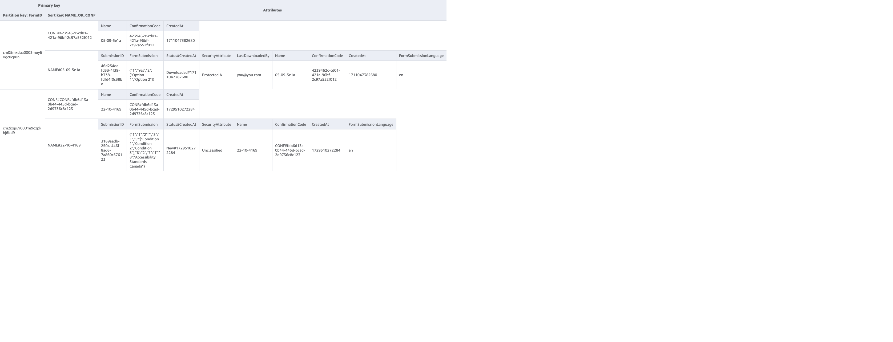

# Forms Terraform

Infrastructure as Code for the GC Forms environment.

## Contributing

Pull Requests in this repository require all commits to be signed before they can be merged. Please see [this guide](https://docs.github.com/en/github/authenticating-to-github/managing-commit-signature-verification) for more information.

## Prerequisites:

- [Docker Hub](https://docs.docker.com/desktop/mac/install/) or [Colima](https://github.com/abiosoft/colima)

- Homebrew:

  ```bash
   /bin/bash -c "$(curl -fsSL https://raw.githubusercontent.com/Homebrew/install/HEAD/install.sh)"
  ```

- Terragrunt:

  1. `brew install warrensbox/tap/tfswitch`
  1. `tfswitch 1.6.6`
  1. `brew install warrensbox/tap/tgswitch`
  1. `tgswitch 0.54.8`

### If using Colima

- Docker: `brew install docker docker-compose docker-credential-manager`

Modify the docker config file to use mac os keychain as `credStore`

```shell
nano ~/.docker/config.json

{
    ...
    "credsStore": "osxkeychain",
    ...
}
```

- Colima: `brew insteall colima`

```shell
# as /var/ is a protected directory, we will need sudo
sudo ln ~/.colima/default/docker.sock /var/run

# we can verify this has worked by running
ls /var/run
# and confirming that docker.sock is now in the directory
```

Colima can be set as a service to start on login: `brew services start colima`

## Request Localstack Pro license

You will need to create a Localstack account using your CDS email address [here](https://app.localstack.cloud/sign-in) and then ask your supervisor to assign you a Pro license license.

## Set your environment variables

Create an `.env` file at the root of the project and use the `.env.example` as a template. You can find some of the values in 1Password > Local Development .ENV secure note. 
The `LOCALSTACK_AUTH_TOKEN` value will be accessible [here](https://app.localstack.cloud/workspace/auth-token) once you have been assigned a Pro license.

## Start Localstack

```shell
$ docker-compose up
```

<details>
<summary>See expected console output</summary>

```shell
[+] Building 0.0s (0/0)
[+] Running 2/2
 ✔ Network forms-terraform_default  Created                                                                               0.1s
 ✔ Container GCForms_LocalStack     Created                                                                               0.1s
Attaching to GCForms_LocalStack
GCForms_LocalStack  |
GCForms_LocalStack  | LocalStack version: 3.2.1.dev20240306170817
GCForms_LocalStack  | LocalStack Docker container id: 00e39dc6785e
GCForms_LocalStack  | LocalStack build date: 2024-03-06
GCForms_LocalStack  | LocalStack build git hash: 93fc329
GCForms_LocalStack  |
GCForms_LocalStack  | 2024-03-27T14:11:56.175  INFO --- [  MainThread] l.bootstrap.licensingv2    : Successfully requested and activated new license <license_identifier>:pro 🔑✅
GCForms_LocalStack  | 2024-03-27T14:11:58.611  INFO --- [  MainThread] l.p.snapshot.plugins       : registering ON_STARTUP load strategy
GCForms_LocalStack  | 2024-03-27T14:11:59.649  INFO --- [  MainThread] l.p.snapshot.plugins       : registering SCHEDULED save strategy
GCForms_LocalStack  | 2024-03-27T14:11:59.713  INFO --- [  MainThread] l.extensions.platform      : loaded 0 extensions
GCForms_LocalStack  | 2024-03-27T14:12:00.097  INFO --- [-functhread4] hypercorn.error            : Running on https://0.0.0.0:4566 (CTRL + C to quit)
GCForms_LocalStack  | 2024-03-27T14:12:00.097  INFO --- [-functhread4] hypercorn.error            : Running on https://0.0.0.0:4566 (CTRL + C to quit)
GCForms_LocalStack  | 2024-03-27T14:12:00.098  INFO --- [-functhread4] hypercorn.error            : Running on https://0.0.0.0:443 (CTRL + C to quit)
GCForms_LocalStack  | 2024-03-27T14:12:00.098  INFO --- [-functhread4] hypercorn.error            : Running on https://0.0.0.0:443 (CTRL + C to quit)
GCForms_LocalStack  | 2024-03-27T14:12:00.316  INFO --- [  MainThread] localstack.utils.bootstrap : Execution of "start_runtime_components" took 602.48ms
GCForms_LocalStack  | Ready.
GCForms_LocalStack  | 2024-03-27T14:12:03.093  INFO --- [  MainThread] l.p.snapshot.plugins       : restoring state of all services on startup
```

</details>

Once Localstack is ready to use you should be able to interact with local AWS services using the [Localstack web application](https://app.localstack.cloud/inst/default/resources).

**If the Localstack web application is not able to connect to the instance you just started you may have to add `127.0.0.1 localhost.localstack.cloud` to your `/etc/hosts`.**

## Deploy infrastructure

Now that we have localstack up and running it's time to deploy our local AWS services to mimic our cloud environments.

#### Deploy on fresh Localstack instance

```shell
$ ./localstack_services.sh clean
```

The `clean` argument will make sure all existing Terraform state files are being deleted first.

#### Deploy on existing Localstack instance

```shell
$ ./localstack_services.sh
```

This is something you may have to do if you want to deploy an infrastructure update to your current Localstack instance.

**Please note that if you stop Localstack you don't need to run this script again.**
**Localstack Pro offers automatic persistence for all deployed services. This is enabled by default and can be tweaked through your `.env` file.**

Congratulations! You should now have all the necessary infrastructure configured on Localstack to support all the web applications functions completely locally without needing an AWS account.

## How to manually invoke a Lambda function

```shell
$ awslocal lambda invoke --function-name <name_of_the_function> output.txt
```

In case you want to invoke a function that expects a specific payload you can pass it using the `--payload '{}'` argument.

## Dynamo Database Table Schemas

### Vault Table

#### Table



#### Archive Global Secondary Index

This Index supports the archiving of Vault responses


#### Status Global Secondary Index

This Index supports the future feature of the Retrieval API. Essentially the ability to retrieve responses without using the Application Interface.


#### Nagware Global Secondary Index

This Index supports the Nagware feature. It gives the ability to retrieve form submissions with a specific status and creation date.


# Traduction en français à venir...